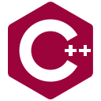

<h1 align="center">Hi there 👋</h1>

  

Hi there, I'm Luca, Federico II computer science student! Here you can find repositories of my projects 😃

- 🔭 I’m currently working on C server and android client for a potholes app.

<h2 align=center>Main Languages</h1>

<h3 align= "center"> 📫 How to reach me: ... </h3>

 email: luca.bianco.71.lb@gmail.com 

<!--
**Luca-Bianco/Luca-Bianco** is a ✨ _special_ ✨ repository because its `README.md` (this file) appears on your GitHub profile.

Here are some ideas to get you started:

- 🔭 I’m currently working on ...
- 🌱 I’m currently learning ...
- 👯 I’m looking to collaborate on ...
- 🤔 I’m looking for help with ...
- 💬 Ask me about ...
- 📫 How to reach me: ...
- 😄 Pronouns: ...
- ⚡ Fun fact: ...
-->
